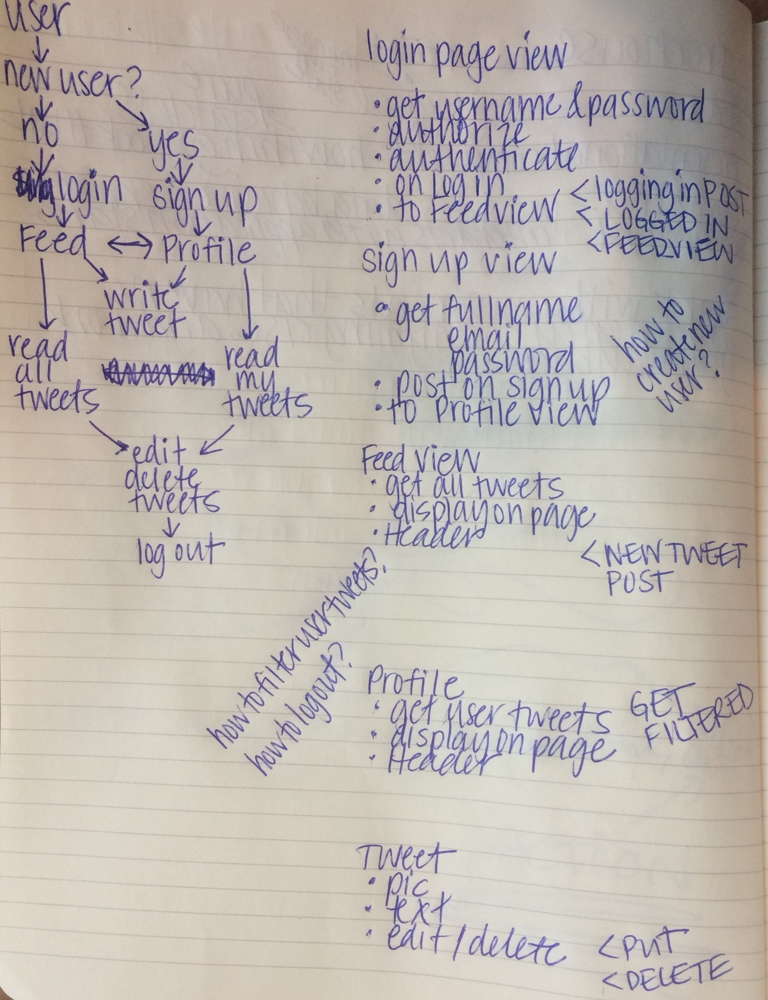
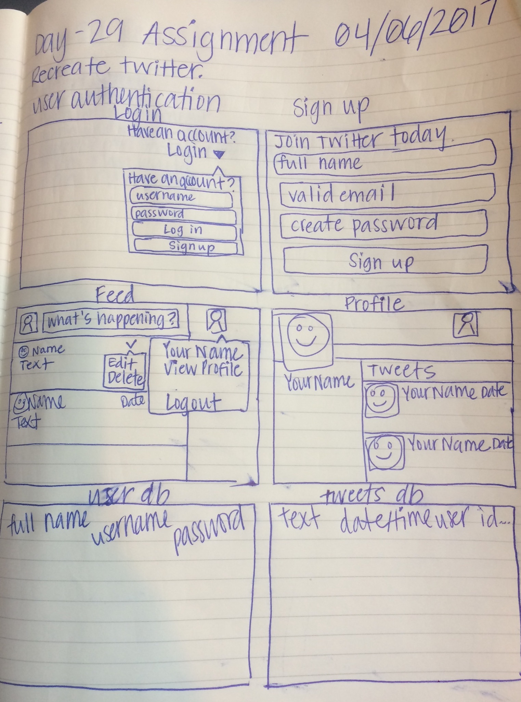

What is it?
-----------

TIY Spring 2017 Front End Assignment

What should it do?
------------------

Create a twitter clone!

EXPLORER MODE

Using a fresh copy of the webpack-starter. Build the following features.
Full user authentication including signup, login, and logout
Full CRUD functionality for tweets.
A user should be able to CRUD on their own tweets, but only read other users' tweets
A 'feed' page that allows users to view all tweets posted by all users
Style the site to be responsive!
Include 'Profile' pages that allow users to view only tweets made by the viewed user, as well as info about that user

ADVENTURER MODE

Include an 'Edit Profile' page that allows users to modify their profile.
Read the Backendless docs and allow users to verify their email address using the built in email verification service
Allow users to include a profile image.

Planning
--------

  
  

[Live Version](friendly-meat.surge.sh)
--------------------------------------------------------------------------------
Created by Devon Moubry. devon@moubry.com
